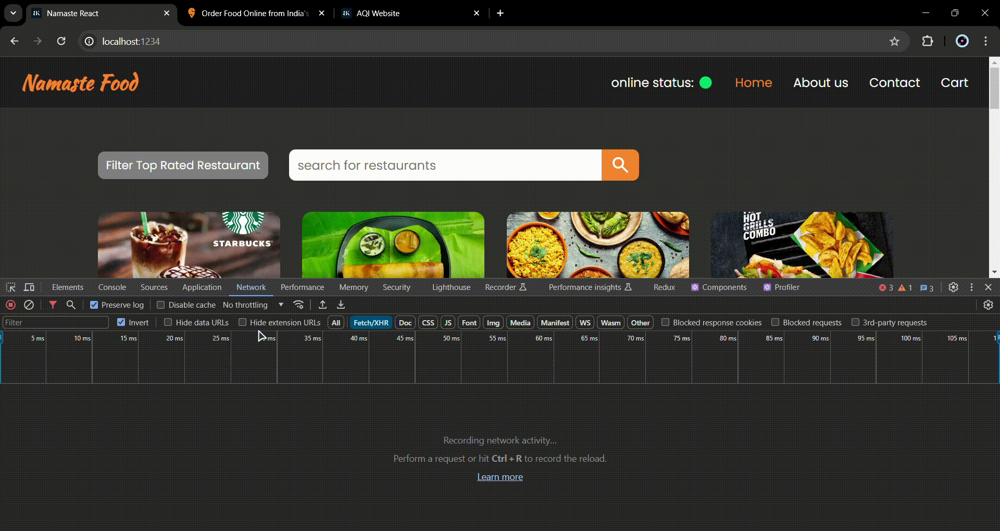
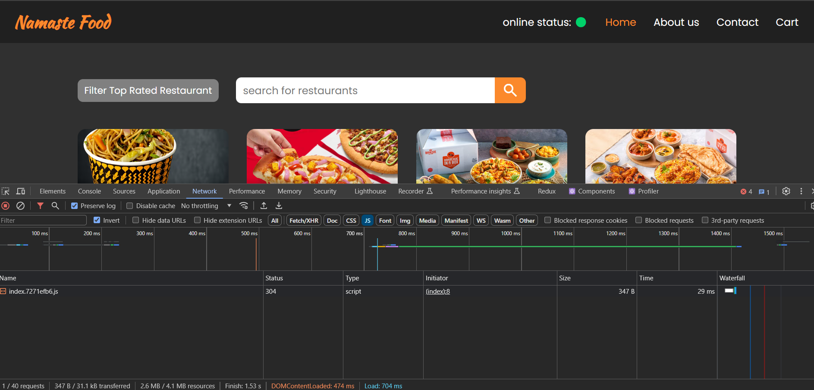
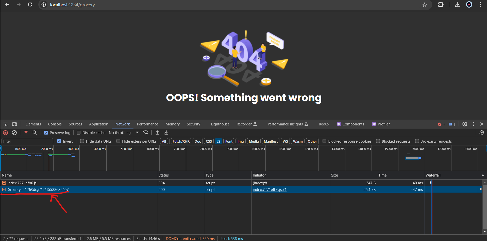
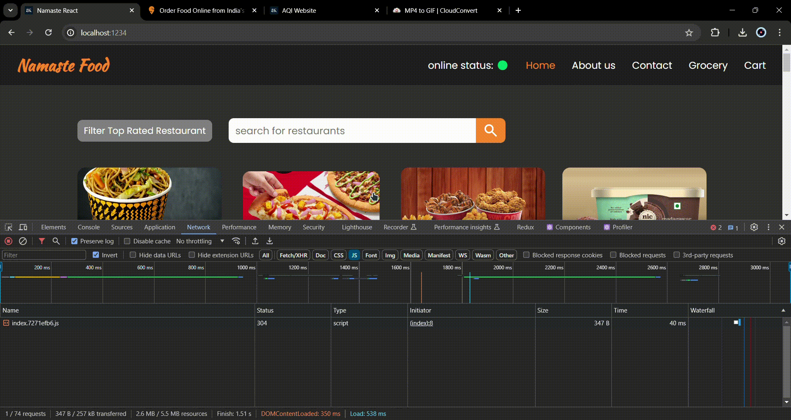
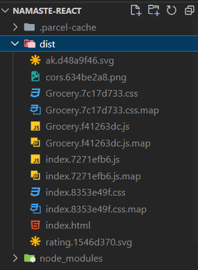
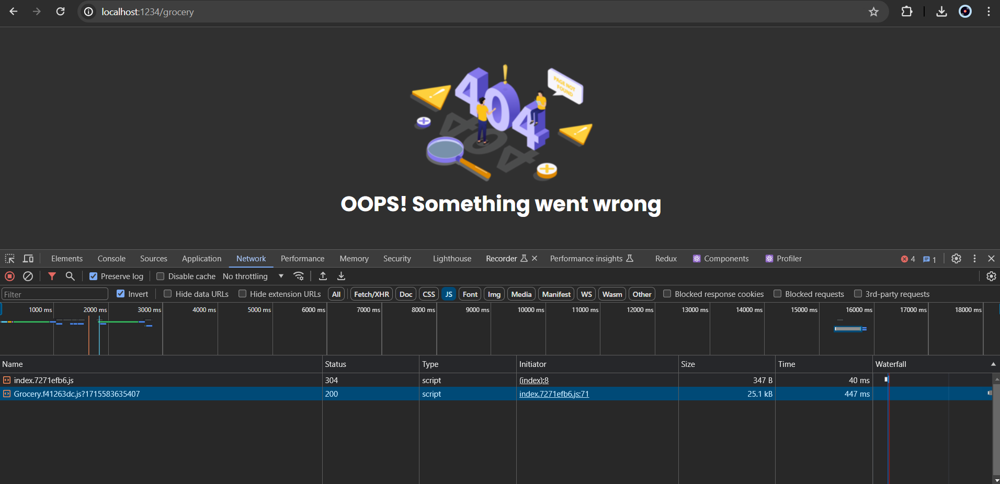

# 📍 Optimizing Our App

<div align="center">

</div>

## ⭐ Custom Hooks

Custom hooks in React are JavaScript functions that enable you to encapsulate reusable logic, similar to how React's built-in hooks like `useState` and `useEffect` work. By creating custom hooks, you can extract stateful logic from components and share it across multiple components in your application.

1. **Prefix with "use"**: Custom hooks must start with the word "**use**" to follow the convention established by React for hooks.

2. **Extract Reusable Logic**: Custom hooks allow you to extract complex logic, side effects, or state management from components, making them more focused and easier to understand.

<br>

> useRestaurantMenu.jsx
```jsx
import { useEffect } from "react";
import { MENU_API } from "./constants";
import { useState } from "react";

const useRestaurantMenu = (resId) => {
  const [resInfo, setResInfo] = useState(null);

  const fetchData = async () => {
    const response = await fetch(MENU_API + resId);
    const json = await response.json();
    setResInfo(json.data);
  };

  useEffect(() => {
    fetchData();
  }, []);

  return resInfo;
};

export default useRestaurantMenu;
```

<br>

> RestaurantMenu.jsx
```jsx
import useRestaurantMenu from "../utils/useRestaurantMenu";

const RestaurantMenu = () => {
  const { resId } = useParams();
  const resInfo = useRestaurantMenu(resId); {* <-- Custom Hook *}

  ....
``` 

>[!IMPORTANT]
> If you don't use the "use" prefix for your custom hooks, the linter may flag it as a violation of coding standards or conventions, depending on the specific rules configured in your linter setup. 

### 💻 Custom Hooks for user online status 

> useOnlineStatus.js
```js
import { useState, useEffect } from "react";

const useOnlineStatus = () => {
  const [onlineStatus, setOnlineStatus] = useState(true);

  useEffect(() => {
    window.addEventListener("online", () => {
      setOnlineStatus(true);
    });

    window.addEventListener("offline", () => {
      setOnlineStatus(false);
    });
  }, []);
  return onlineStatus;
};

export default useOnlineStatus;
```


---

## ⭐ Bunlder and Minification Process

Bundlers like Parcel take your React code, along with any other assets and dependencies, and process them to generate a single, optimized bundle file (typically named something like `index.js`)

This process begins with resolving dependencies and applying necessary transformations, such as transpiling modern JavaScript syntax to ensure broad browser compatibility. Subsequently, tree shaking is performed to remove any redundant code or unused exports from the bundle. 

### ⛔ Issues


One potential issue with bundling all files into a single bundle is the increase in bundle size. Combining all dependencies, including JavaScript modules and assets, into one file can result in a **larger bundle size**, especially for larger projects with many dependencies. This larger bundle size may lead to **longer loading times** for the application, especially on slower network connections. Additionally, bundling all code into one file can make it more challenging to manage and debug, as developers have to navigate through a single large file instead of smaller, more manageable modules



### ✅ Chunking and Code Splitting

Bundling code is not inherently a bad practice, but it's essential to consider the trade-offs involved. While bundling can simplify deployment and improve performance in many cases, there are potential downsides, such as increased bundle size and longer load times.

**While bundling can simplify deployment and improve performance in many cases, it's essential to consider the specific needs and requirements of your project. In some cases, alternative strategies such as *code splitting* or *lazy loading* may be more appropriate to mitigate the downsides of bundling.**

* Code Splitting

* Dynamic Bundling
* Chunking
* Lazy Loading
* On-demand Loading

## ⭐ Lazy Loading

Lazy loading in React allows you to split your code into smaller chunks, loading only the code that is needed for a particular part of your application when it is actually required. This can improve the initial loading time of your application.

### ⚡ lazy

`lazy` function allows you to dynamically import a component using dynamic import syntax (`import()`). It takes a function that returns a Promise, which resolves to the dynamically imported component

> App.js
```jsx
const Grocery = lazy(() => import("./Components/Grocery"))
```

<br>

> App.js
```jsx
const appRouter = createBrowserRouter([
  {
    path: "/",
    element: <App />,
    errorElement: <Error />,
    children: [
      {
        path: "/grocery",
        element: <Grocery />,
      },
    ],
  },
]);

```

[Click here for the App.js full code](./Codes/App.js)

[Click here for the Grocery.jsx full code](./Codes/Grocery.jsx)

When i trying to visit `/grocery` the page throws an error, but in the `Network` tab it should displayed another bundled js file




And also it added to the `dist` folder 



<br>

you have a route `/grocery` that triggers the lazy loading of a component using `lazy`. Without a `Suspense` component to handle loading states, when navigating to the `/grocery` route, React will start fetching the component code asynchronously. However, since there is no fallback UI specified, the page will remain blank or display incomplete content until the component is fully loaded.



The Example picture provided above is shows the Error Page, but not the `Grocery` component. Because the when you visit the link `/grocery` React will visit very quickly, on the other hand the Lazy loaded component `<Grocery />` loaded slowly as you can see on Network tab and it takes about **447ms** to load. Due to this React suspend its loading and displays the error element.