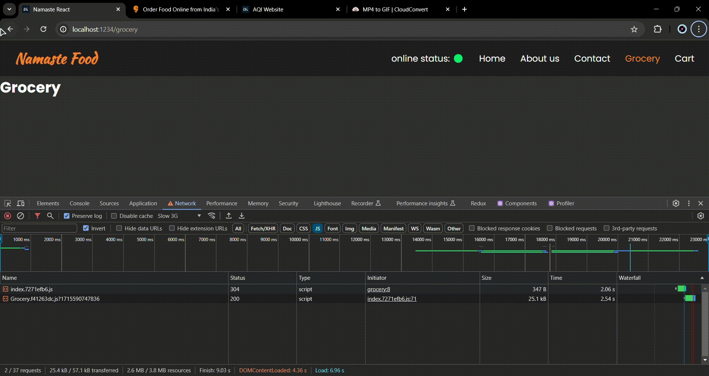
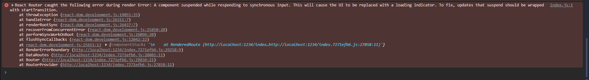

# 📍 Optimizing Our App

<div align="center">

</div>

## ⭐ Custom Hooks

Custom hooks in React are JavaScript functions that enable you to encapsulate reusable logic, similar to how React's built-in hooks like `useState` and `useEffect` work. By creating custom hooks, you can extract stateful logic from components and share it across multiple components in your application.

1. **Prefix with "use"**: Custom hooks must start with the word "**use**" to follow the convention established by React for hooks.

2. **Extract Reusable Logic**: Custom hooks allow you to extract complex logic, side effects, or state management from components, making them more focused and easier to understand.

<br>

> useRestaurantMenu.jsx
```jsx
import { useEffect } from "react";
import { MENU_API } from "./constants";
import { useState } from "react";

const useRestaurantMenu = (resId) => {
  const [resInfo, setResInfo] = useState(null);

  const fetchData = async () => {
    const response = await fetch(MENU_API + resId);
    const json = await response.json();
    setResInfo(json.data);
  };

  useEffect(() => {
    fetchData();
  }, []);

  return resInfo;
};

export default useRestaurantMenu;
```

<br>

> RestaurantMenu.jsx
```jsx
import useRestaurantMenu from "../utils/useRestaurantMenu";

const RestaurantMenu = () => {
  const { resId } = useParams();
  const resInfo = useRestaurantMenu(resId); {* <-- Custom Hook *}

  ....
``` 

>[!IMPORTANT]
> If you don't use the "use" prefix for your custom hooks, the linter may flag it as a violation of coding standards or conventions, depending on the specific rules configured in your linter setup. 

### 💻 Custom Hooks for user online status 

> useOnlineStatus.js
```js
import { useState, useEffect } from "react";

const useOnlineStatus = () => {
  const [onlineStatus, setOnlineStatus] = useState(true);

  useEffect(() => {
    window.addEventListener("online", () => {
      setOnlineStatus(true);
    });

    window.addEventListener("offline", () => {
      setOnlineStatus(false);
    });
  }, []);
  return onlineStatus;
};

export default useOnlineStatus;
```


---

## ⭐ Bunlder and Minification Process

Bundlers like Parcel take your React code, along with any other assets and dependencies, and process them to generate a single, optimized bundle file (typically named something like `index.js`)

This process begins with resolving dependencies and applying necessary transformations, such as transpiling modern JavaScript syntax to ensure broad browser compatibility. Subsequently, tree shaking is performed to remove any redundant code or unused exports from the bundle. 

### ⛔ Issues


One potential issue with bundling all files into a single bundle is the increase in bundle size. Combining all dependencies, including JavaScript modules and assets, into one file can result in a **larger bundle size**, especially for larger projects with many dependencies. This larger bundle size may lead to **longer loading times** for the application, especially on slower network connections. Additionally, bundling all code into one file can make it more challenging to manage and debug, as developers have to navigate through a single large file instead of smaller, more manageable modules


### ✅ Chunking and Code Splitting

Bundling code is not inherently a bad practice, but it's essential to consider the trade-offs involved. While bundling can simplify deployment and improve performance in many cases, there are potential downsides, such as increased bundle size and longer load times.

**While bundling can simplify deployment and improve performance in many cases, it's essential to consider the specific needs and requirements of your project. In some cases, alternative strategies such as *code splitting* or *lazy loading* may be more appropriate to mitigate the downsides of bundling.**

* Code Splitting

* Dynamic Bundling
* Chunking
* Lazy Loading
* On-demand Loading

## ⭐ Lazy Loading

Lazy loading in React allows you to split your code into smaller chunks, loading only the code that is needed for a particular part of your application when it is actually required. This can improve the initial loading time of your application.

Here are some of the benefits of using lazy loading in React:

**Improved initial load time**: Lazy loading can improve the initial load time of your application by reducing the amount of code that needs to be downloaded and parsed when the page first loads.

**Reduced memory usage**: Lazy loading can reduce the amount of memory that is used by your application by deferring the loading of resources until they are needed.

**Improved user experience**: Lazy loading can improve the user experience by making your application feel more responsive.

**When to use lazy loading**: For example, if a web page has an image that the user has to scroll down to see, you can display a placeholder and lazy load the full image only when the user arrives to its location.

### ⚡ lazy

`lazy` function allows you to dynamically import a component using dynamic import syntax (`import()`). It takes a function that returns a Promise, which resolves to the dynamically imported component

> App.js
```jsx
const Grocery = lazy(() => import("./Components/Grocery"))
```

<br>

> App.js
```jsx
const appRouter = createBrowserRouter([
  {
    path: "/",
    element: <App />,
    errorElement: <Error />,
    children: [
      {
        path: "/grocery",
        element: <Grocery />,
      },
    ],
  },
]);

```

[Click here for the App.js full code](./Codes/App.js)

[Click here for the Grocery.jsx full code](./Codes/Grocery.jsx)

When i trying to visit `/grocery` the page throws an error, but in the `Network` tab it should displayed another bundled js file


And also it added to the `dist` folder 


<br>

you have a route `/grocery` that triggers the lazy loading of a component using `lazy`. Without a `Suspense` component to handle loading states, when navigating to the `/grocery` route, React will start fetching the component code asynchronously. However, since there is no fallback UI specified, the page will remain blank or display incomplete content until the component is fully loaded.


The Example picture provided above is shows the Error Page, but not the `Grocery` component. Because the when you visit the link `/grocery` React will visit very quickly, on the other hand the Lazy loaded component `<Grocery />` loaded slowly as you can see on Network tab and it takes about **447ms** to load. Due to this React suspend its loading and displays the error element.

To fix this we need `Suspense` component

### ⚡ Suspense

When you use `lazy` to lazily load a component, **React suspends rendering while the component is being loaded asynchronously**. During this suspended state, React needs to display a fallback UI to indicate to the user that content is loading.

1. **Initiating Lazy Loading**: When you use React.lazy to import a component lazily, React starts fetching the component code asynchronously as soon as the lazy-loaded component is rendered or encountered in the component tree.

2. **Suspended State**: While the lazy-loaded component is being fetched, React suspends rendering of the component tree. This means that React will not render any part of the tree that depends on the lazy-loaded component until it is fully loaded.

3. **Fallback UI**: To provide visual feedback to the user during the loading process, you use the **Suspense** component to specify a fallback UI to render while the lazy-loaded component is being loaded. This fallback UI can be any React element, such as a loading spinner, progress indicator, or placeholder content.

4. **Resuming Rendering**: Once the lazy-loaded component is fully loaded, React resumes rendering the suspended component tree and replaces the fallback UI with the actual content of the lazy-loaded component.

**Suspense is a new feature in React 16.6 that allows developers to display a fallback UI while waiting for data to load. This can be useful for improving the perceived performance of your application, as users will not see a blank screen while they wait for data to fetch.**

To use Suspense, you can wrap any component that fetches data in a `<Suspense>` component. The `<Suspense>` component will render the fallback UI until the data is loaded, and then it will render the wrapped component.

> App.js

```js

const Grocery = lazy(() => import("./components/Grocery"));

const appRouter = createBrowserRouter([
  {
    path: "/",
    element: <App />,
    errorElement: <Error />,
    children: [
      {
        path: "/grocery",
        element: (
          <Suspense fallback={<h1>Loading....</h1>}>
            <Grocery />
          </Suspense>
        ),
      },
    ],
  },
]);
```


---

## 🙋‍♂️ QnA

#### ❓ Why we got this error: A component was suspended while responding to synchronous input. This will cause the UI to be replaced with a loading indicator. To fix this, updates that suspend should be wrapped with start transition? How does suspense fix this error?



This error is thrown as Exception by React when the promise to dynamically import the lazy component is not yet resolved and the Component is expected to render in the meantime. If only the dynamic import is done and there is no `<Suspense />` component then this error is shown.

React expects a Suspense boundary to be in place for showing a fallback prop until the promise is getting resolved. If showing the shimmer (loading indicator) is not desirable in some situations, then **startTransistion API** can used to show the old UI while new UI is being prepared. React do this without having to delete or remove the **Suspense** component or its props from your code.

---

#### ❓ Advantages and Disadvantages of using this code splitting pattern?

Code splitting is a technique that splits an application's JavaScript bundle into smaller chunks, which are loaded dynamically as needed. This allows an application to load only the code it needs at a given time, and load other bundles on demand.

Code splitting can have many benefits, including:

* **Faster initial load time**: By only loading the necessary code for the initial view, code splitting can significantly improve the time it takes for the page to load. This can be especially helpful on slower network connections or devices.

* **Improved user experience**: Code splitting can allow users to interact with the application sooner, and non-essential code can be loaded asynchronously in the background to improve the overall responsiveness of the application.

* **Improved performance**: Code splitting can reduce the amount of JavaScript that needs to be parsed and executed.

However, code splitting can also have some drawbacks, including:

* Increased complexity in development and testing processes

* More network requests that can affect performance

* Additional code and dependencies that can increase the bundle size

---

#### ❓ When do we and why do we need suspense?

Suspense is a React feature that allows developers to display a temporary UI while waiting for data to load. It's best used when you want to display a fallback while waiting for something to load, such as when waiting for data to be fetched from an API after the initial page load.

Suspense is often used in conjunction with React's dynamic import mechanism called lazy(). Lazy loading refers to the requirement that a component or portion of code will load only when it's needed. This functionality helps to minimize your application's loading speed and lower the initial bundle size.