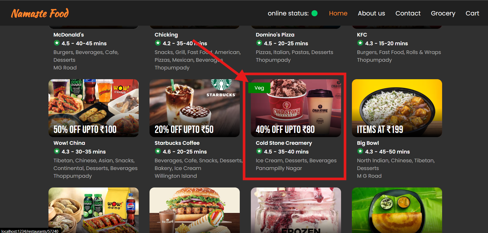
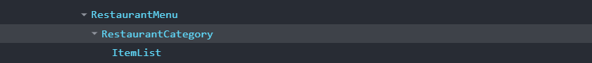

# 📍 Data is the New Oil

<div align="center">

</div>
<br>

## ⭐ Higher Order Component

A Higher-Order Component (HOC) in React is a pattern used to share common functionality between components. **An HOC is a function that takes a component and returns a new component with additional props or functionality.**

Think of an HOC as a wrapper that adds extra features to a component without modifying the original component directly. This is useful for reusing component logic across multiple components.

### ⚡ Defining Higher Order Components

```jsx
export const withVegLabel = (RestaurantCard) => {
  return ({ data }) => {
    return (
      <div className="with-veg">
        <p className="veg-label">Veg</p>
        <RestaurantCard data={data} /> // <---- Another Component
      </div>
    );
  };
};
```

In your code, `withVegLabel` is an HOC. It's a function that takes a component (`RestaurantCard`) and returns a new component that enhances the original component with additional functionality.

### ⚡ Using the HOC

```jsx
const RestaurantCardVeg = withVegLabel(RestaurantCard);
```

`RestaurantCardVeg` is now a component that includes the additional "Veg" label.

### ⚡ Rendering Components Conditionally

```jsx
{
  value?.info?.veg ? (
    <RestaurantCardVeg data={value} />
  ) : (
    <RestaurantCard data={value} />
  );
}
```
**FULL CODE**

1. [Body.jsx](./code/Body.jsx) 
2. [RestaurantCard.jsx](./code/RestaurantCard.jsx)

Think of `withVegLabel` as a wrapper that adds a "Veg" badge to a product card. If the product is vegetarian, it adds the badge; otherwise, it displays the product card as is. This way, the core product card design remains unchanged, but you have the flexibility to enhance it with additional information when needed.



---

## ⭐ Props Drilling



consider a situation, I want to pass data from the component **`RestaurantMenu`** to the component **`ItemList`**, But iam not able to pass the data directly. we need to pass it to the lower children (**`RestaurantCategory`**) and this component then pass it to the lower children.

> [!NOTE]
> There is no use of data in between **`RestaurantCategory`** component 

<div align="center">

</div>
<br>

### ⚡ What is prop drilling

Prop drilling is a fundamental concept in React that involves passing data down through nested components in a React application. It plays a crucial role in maintaining communication between parent and child components within the component tree.

Prop drilling occurs when a parent component passes data down to its children and then those children pass the same data down to their own children. This process can continue indefinitely. At the end, it's a long chain of component dependencies that can be difficult to manage and maintain.

### ⚡ Problems with Props Drilling

* **code duplication**: When data needs to be passed down through multiple layers of components, it can result in code duplication. This occurs when the same data is passed down to multiple child components, even though they may not need all of it.

* **Reduced Readability**: As the number of components and the depth of nesting increase, it becomes difficult to track where the data is coming from and how it is being passed down. This can reduce the overall readability and increase the cognitive load on developers.

### ⚡ Solution 

1. **Context API**: React's Context API allows you to create a context and provide it at a higher level in the component tree. This way, any component within the tree can consume the context directly without the need for props drilling.

2. **State Management Libraries**: Libraries like Redux, MobX, or Zustand provide centralized state management solutions. These libraries allow you to manage the state in a single location and access it from any component in the application.

3. **Component Composition**: Using component composition patterns such as render props or higher-order components (HOCs) can help pass data and behavior without deeply nesting props.

4. **Custom Hooks**: Custom hooks can encapsulate and manage state, making it easier to share stateful logic between components without the need for props drilling.