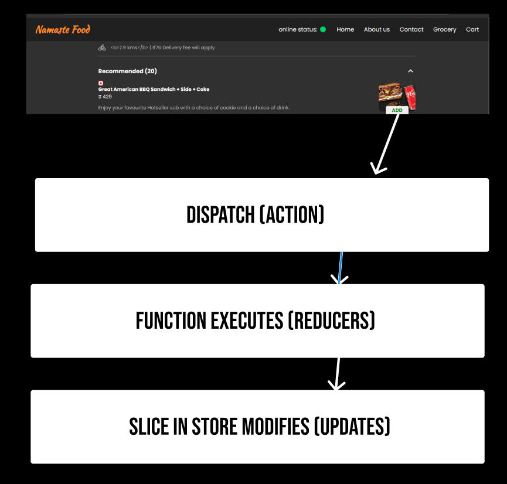
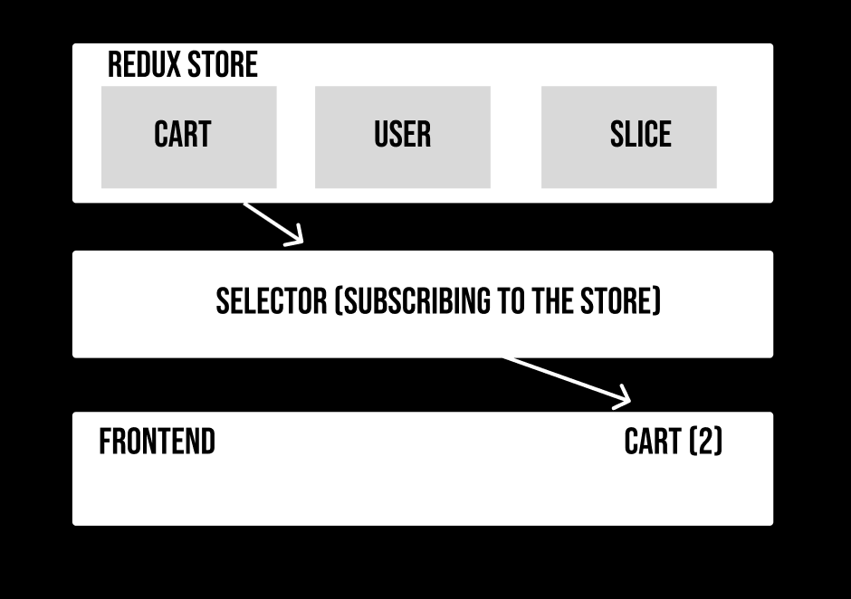
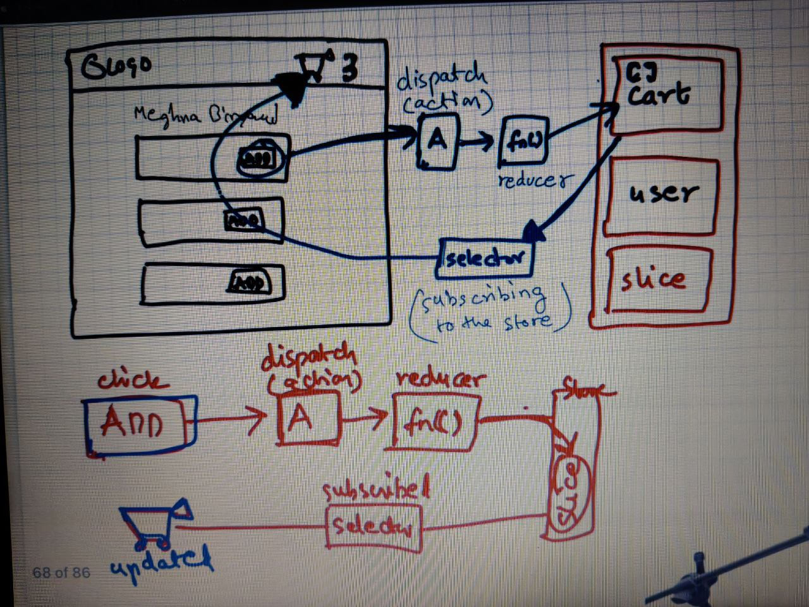

# Let's Build Our Store

<div align="center">

</div>

## ⭐ What is Redux ?

Redux is a state management library often used with React to manage the application's global state in a predictable way. It centralizes the application's state in a **single store**, allowing components to access and update the state through **actions** and **reducers**, which describe how the state should change in response to specific actions. This approach simplifies state management in complex applications by providing a clear and structured way to handle data flow, making the application easier to debug, test, and maintain.

---
### 💫 `react-redux`

React Redux is an essential library for managing state in large-scale React applications. It acts as a bridge between React and Redux, enabling React components to interact seamlessly with the Redux store. By centralizing the state management, React Redux allows developers to manage and share state across various components without prop drilling, leading to cleaner and more maintainable code. It provides a `Provider` component to make the Redux store available to the entire application and hooks like `useSelector` and `useDispatch` for accessing the state and dispatching actions directly within functional components. This integration simplifies the process of state management, making it easier to handle complex state logic and asynchronous actions.

### 💫 `Redux Toolkit`

Redux Toolkit is the recommended way to write Redux logic due to its ability to streamline the setup and management of Redux stores. It addresses common pain points such as boilerplate code and complex configurations by providing utility functions like `configureStore` and `createSlice`. `configureStore` simplifies the store configuration with sensible defaults, including middleware and Redux DevTools integration, while `createSlice` reduces boilerplate by combining reducers and actions into a single object. Additionally, features like `createAsyncThunk` handle asynchronous actions more gracefully. By using Redux Toolkit, developers can write more concise, readable, and maintainable Redux code, ultimately enhancing productivity and reducing errors in state management.

> [!NOTE]
> redux store is big object with more data and it is kept in the global central place, we should keep most of our application data into this redux store.

<div align="center">

</div>

---

## ⭐ Slice


In Redux, a "slice" refers to a portion of the Redux state and the logic associated with that portion. The concept of a slice simplifies the process of writing Redux logic by grouping related actions and reducers together. Redux Toolkit, the official toolset for efficient Redux development, introduces the `createSlice` function to facilitate this.

### 💫 What is a Slice?

A slice represents a single unit of the Redux state and includes:

* **State**: The part of the overall state that the slice manages.

* **Reducers**: Functions that handle changes to the state based on specific actions.

* **Actions**: Named events that can be dispatched to trigger state changes.

---

### ⭐ Write data in redux 



### ⭐ Read Data





---

## Reduxjs/Toolkit

| Sno. | Context | 
| --- | --- |
| 1. | installation `@reduxjs/toolkit` and `react-redux`
| 2. | Build our store
| 3. | Connect our store to our app
| 4. | create Slice (cartSlice)
| 5. | dispatch(action)
| 6. | Selector

---

### ⚡ Installation

```
npm i @reduxjs/toolkit react-redux
```

### ⚡ Build our store

> utils/appStore.js

```js
import { configureStore } from "@reduxjs/toolkit";

const appStore = configureStore();

export default appStore;
```

### ⚡ Connect our store to our app

> App.js

```jsx
import { Provider } from "react-redux";
import appStore from "./utils/appStore";
```

```jsx

root.render(
  <Provider store={appStore}>
    <RouterProvider router={appRouter} />
  </Provider>
);
```

### ⚡create Slice (cartSlice)

> config/cartSlice.js

```js
import { createSlice } from "@reduxjs/toolkit";

const cartSlice = createSlice({
  name: "cart",
  initialState: {
    items: [],
  },
  reducers: {
    addItem: (state, action) => {
      state.items.push(action.payload);
    },
    removeItem: (state, action) => {
      state.items.pop();
    },
    clearCart: (state, action) => {
      state.items.length = 0
    },
  },
});

export const { addItem, removeItem, clearCart } = cartSlice.actions;
export default cartSlice.reducer;
```

> /config/appStore.js

```js
import { configureStore } from "@reduxjs/toolkit";
import cartReducer from "./cartSlice";

const appStore = configureStore({
  reducer: {
    cart: cartReducer,
  },
});

export default appStore; 
```

---

In vanilla Redux (using the Redux library without additional helpers like Redux Toolkit), state management involves adhering strictly to the principles of immutability. This means that instead of directly mutating the state, you return a new state object with the necessary changes.

### Vanilla Redux

In vanilla Redux, reducers must always return a new state object rather than mutating the existing state. This immutability is crucial for enabling features like time-travel debugging and predictable state updates. When you need to update the state, you typically use techniques like object spreading or array spreading to create a copy of the state with the necessary changes.

#### example code 
```
const newState = [...state];
newState.item.push(action.payload);
return newState
```

> [!NOTE]
> Reduxjs uses immer

### How Redux State Immutability Works

When you write a reducer function in Redux, the `state` parameter is a reference to the current state. Directly mutating this state inside the reducer is against Redux principles because Redux expects you to return a new state object. If you mutate the state directly, it might appear to change locally within the reducer function, but this does not actually update the state in the Redux store. Redux cannot detect these changes, leading to bugs and inconsistencies.

### console log from slice

```js
clearCart: (state, action) => {
  console.log(current(state));
  state.items = [];
},
```
---